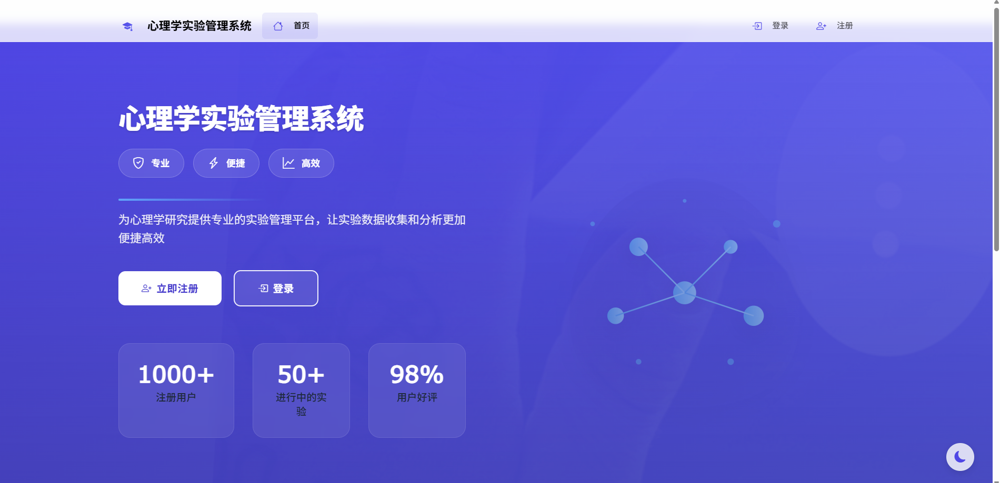
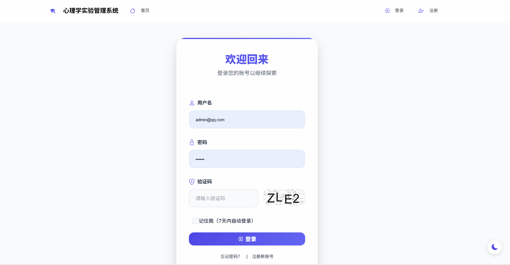
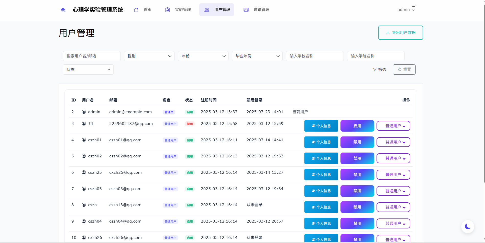
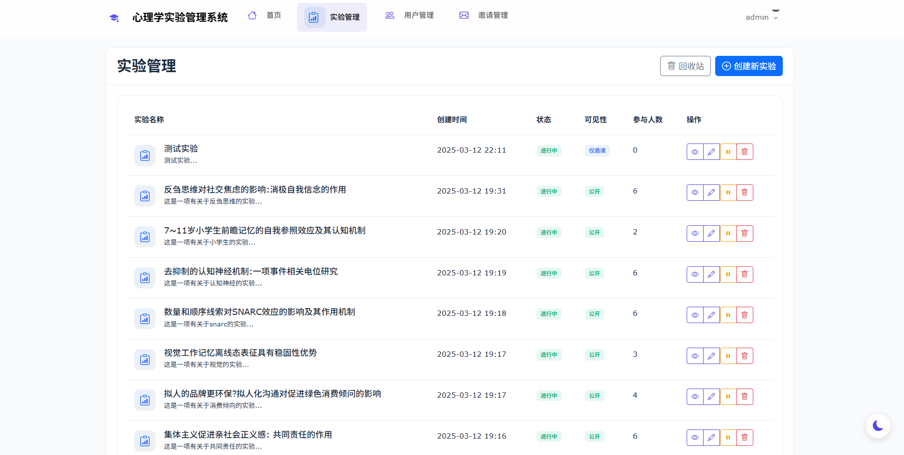
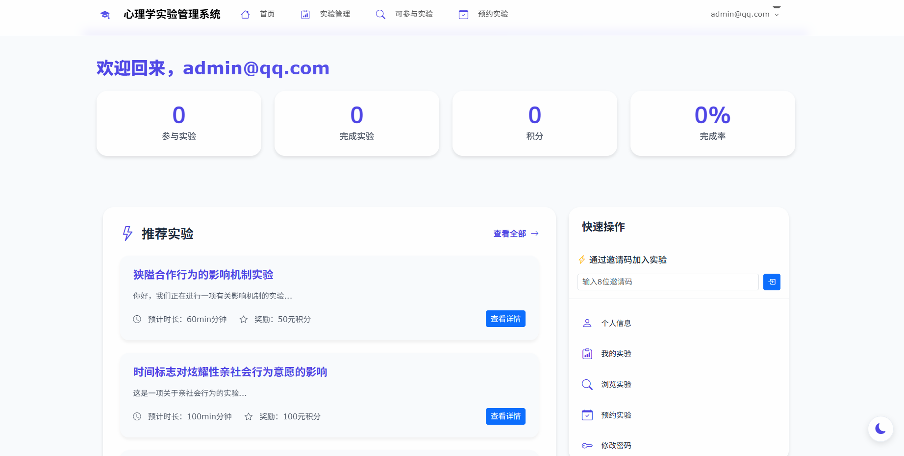
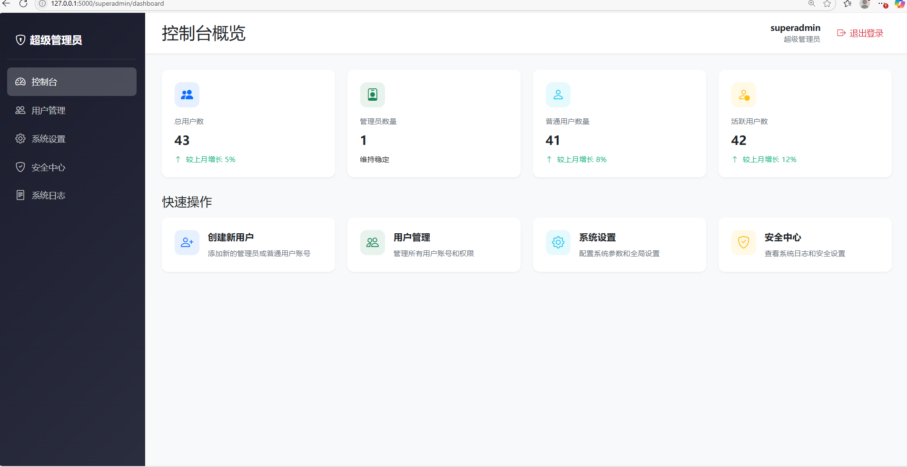

# 心理学实验管理系统

## 项目简介

这是一个基于Flask框架开发的心理学实验管理系统，具有美观的UI设计和完善的功能体系。系统支持深色/浅色主题切换，响应式布局，提供了实验管理、用户参与、数据统计等全方位功能。

## 系统界面预览








## 系统特色

1. **现代化UI设计**
   - 支持深色/浅色主题切换
   - 响应式布局，适配各种设备
   - 毛玻璃特效设计
   - Bootstrap 5 + Bootstrap Icons

2. **完善的权限管理**
   - 超级管理员/管理员/普通用户三级角色区分
   - 基于角色的功能访问控制
   - 细粒度的操作权限管理

3. **灵活的实验管理**
   - 多种实验可见性选项（公开、仅邀请、邀请码）
   - 智能的邀请码系统
   - 完整的实验生命周期管理
   - **新特性：实验自动开始功能**（可设置计划时间自动启动实验）

4. **自动化任务调度器**
   - 后台定时任务系统
   - 自动处理实验状态变更
   - 定时检查和发送通知

## 技术栈

### 后端
- **Flask**: Python Web框架
- **SQLAlchemy**: ORM框架，用于数据库操作
- **Flask-Login**: 用户认证管理
- **Flask-WTF**: 表单处理和CSRF保护
- **Pillow**: 图像处理（用于验证码生成）
- **Pytz**: 时区处理

### 前端
- **Bootstrap 5**: UI框架
- **jQuery**: JavaScript库
- **Bootstrap Icons**: 图标库
- **AOS**: 滚动动画库

### 数据库
- **SQLite**: 开发环境数据库
- 支持 MySQL/PostgreSQL 等关系型数据库

## 系统功能

### 用户管理
- 多角色支持：超级管理员、管理员、普通用户
- 用户注册与登录（支持验证码）
- 个人信息维护
- 密码重置

### 实验管理
- 实验创建与编辑
- 实验状态管理（草稿、进行中、已完成）
- 实验参与控制（公开、私有、邀请码）
- **新特性：计划开始时间**（自动启动实验）
- 实验数据导出

### 参与者管理
- 实验报名和预约
- 邀请码系统
- 实验进度跟踪
- 参与历史记录

### 通知系统
- 实验状态变更通知
- 邀请通知
- 系统公告

### 安全特性
- CSRF 防护
- 密码加密存储
- 会话管理
- 权限控制

## 一键部署指南

### 系统要求
- Python 3.8+
- pip 包管理器
- 虚拟环境（推荐）

### 部署步骤

1. **克隆项目**
   ```bash
   git clone [项目地址] 或解压项目压缩包
   cd 项目目录
   ```

2. **创建并激活虚拟环境**
   ```bash
   # Windows
   python -m venv venv
   venv\Scripts\activate
   
   # Linux/Mac
   python3 -m venv venv
   source venv/bin/activate
   ```

3. **安装依赖项**
   ```bash
   pip install -r requirements.txt
   ```
   
   **Windows用户注意**：如果需要使用MySQL，请按README中的说明手动安装mysqlclient。

4. **初始化并启动**
   ```bash
   python run.py
   ```
   
   首次运行会自动:
   - 初始化数据库
   - 创建超级管理员和管理员账号
   - 启动自动任务调度器
   - 启动Web服务器

5. **访问系统**
   - 打开浏览器访问: http://127.0.0.1:5000
   - 使用默认账号登录:
     * 管理员: admin / admin123
     * 超级管理员: superadmin / superadmin@2024

### 配置数据库（可选）

默认使用SQLite数据库。如需使用MySQL，编辑`config.py`:

```python
# SQLite (默认)
SQLALCHEMY_DATABASE_URI = 'sqlite:///app.db'

# MySQL (取消注释并修改)
# SQLALCHEMY_DATABASE_URI = 'mysql://用户名:密码@localhost/数据库名'
```

### 常见问题解决

1. **端口冲突**
   
   如果5000端口被占用，编辑`run.py`，修改端口号:
   ```python
   app.run(debug=True, port=5001)  # 修改为其他端口
   ```

2. **依赖安装失败**
   
   对于Windows用户，某些包可能需要编译器。推荐使用预编译的wheel文件:
   ```bash
   # 例如安装mysqlclient
   pip install 下载的wheel文件路径
   ```

3. **应用上下文错误**
   
   如果遇到"Working outside of application context"错误，请确保重启应用。此错误通常与任务调度器有关，已在最新版本中修复。

## 主要功能说明

### 管理员功能
- 创建和管理实验
- 设置实验可见性和参与条件
- 设置实验计划开始时间
- 查看参与者统计
- 发送邀请给特定用户

### 用户功能
- 浏览可参与实验
- 预约实验
- 通过邀请码参与实验
- 查看参与历史

## 许可证

MIT License

## 功能详解

### 1. 管理员功能

#### 实验管理
- 创建新实验
  * 设置实验基本信息（标题、描述、时长、报酬）
  * 配置可见性选项
  * 自定义邀请码
- 实验状态管理
  * 草稿状态
  * 招募中
  * 已结束
- 数据管理
  * 导出实验数据
  * 查看统计信息
  * 参与者管理

#### 用户管理
- 查看用户列表
- 发送实验邀请
- 管理邀请状态

### 2. 用户功能

#### 实验参与
- 浏览可用实验
- 使用邀请码加入
- 响应实验邀请
- 追踪实验进度

#### 个人中心
- 查看参与历史
- 管理实验进度
- 查看个人积分
- 接收实验通知

## 新环境完整部署指南

### 1. 基础环境准备

#### Windows系统：
1. 安装Python 3.8或更高版本
   - 访问Python官网(https://www.python.org/downloads/)下载安装包
   - 运行安装程序时，必须勾选"Add Python to PATH"选项
   - 安装完成后，打开命令提示符(cmd)，输入`python --version`验证安装

2. 安装数据库（根据需求选择）
   - SQLite（默认，无需额外安装）
   - MySQL（可选）：
     * 下载MySQL安装包：https://dev.mysql.com/downloads/installer/
     * 安装MySQL Server和MySQL Workbench
     * 记住设置的root密码

### 2. 项目部署

1. 解压项目文件
   - 将收到的压缩包解压到合适的目录
   - 例如：`D:\projects\psychology-system`
   - 记住这个路径，后面需要用到

2. 创建并激活虚拟环境
   ```bash
   # 打开命令提示符(cmd)
   cd D:\projects\psychology-system  # 进入项目目录
   
   # 创建虚拟环境
   python -m venv venv
   
   # 激活虚拟环境
   venv\Scripts\activate
   
   # 如果提示"无法加载文件，因为在此系统上禁止运行脚本"
   # 以管理员身份打开PowerShell，执行：
   Set-ExecutionPolicy RemoteSigned
   # 然后选择 Y
   ```

3. 安装项目依赖
   ```bash
   # 确保在虚拟环境中
   python -m pip install --upgrade pip
   pip install -r requirements.txt
   ```

### 3. 数据库配置

系统默认使用 SQLite 数据库，如需使用 MySQL，请按以下步骤操作：

1. 创建数据库
```sql
CREATE DATABASE psychology_system CHARACTER SET utf8mb4 COLLATE utf8mb4_unicode_ci;
```

2. 安装 MySQL 驱动
```bash
pip install mysqlclient
```

3. 修改配置文件
打开 `config.py`，修改数据库连接：
```python
# 本地MySQL
SQLALCHEMY_DATABASE_URI = 'mysql://用户名:密码@localhost/psychology_system'

# 远程MySQL
# SQLALCHEMY_DATABASE_URI = 'mysql://用户名:密码@服务器IP:3306/psychology_system'
```

4. 初始化数据库
```bash
python run.py
```
首次运行会自动创建数据表和管理员账号（admin/admin123）。

### 4. 启动系统

1. 确保在项目目录下，虚拟环境已激活

2. 启动应用
   ```bash
   python run.py
   ```

3. 访问系统
   - 打开浏览器，访问：http://127.0.0.1:5000
   - 使用默认管理员账号登录：
     * 用户名：admin
     * 密码：admin123

### 5. 常见部署问题

1. 端口占用问题
   - 报错："端口5000被占用"
   - 解决方法：
     * 修改`run.py`中的端口号
     ```python
     app.run(port=5001)  # 改为其他端口
     ```